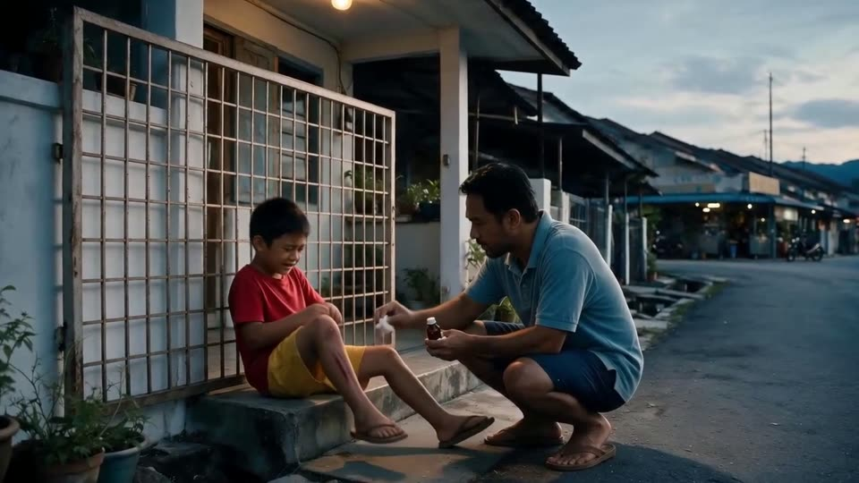
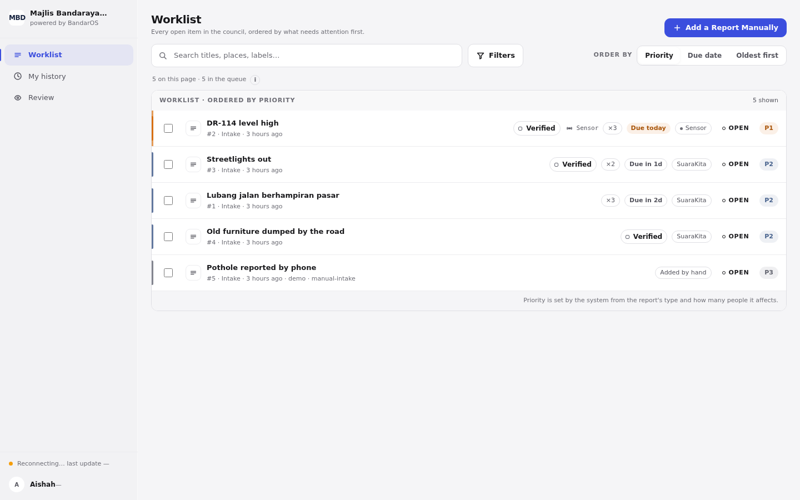
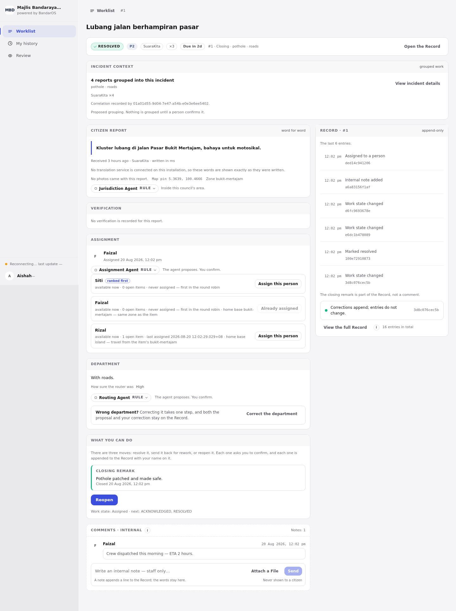
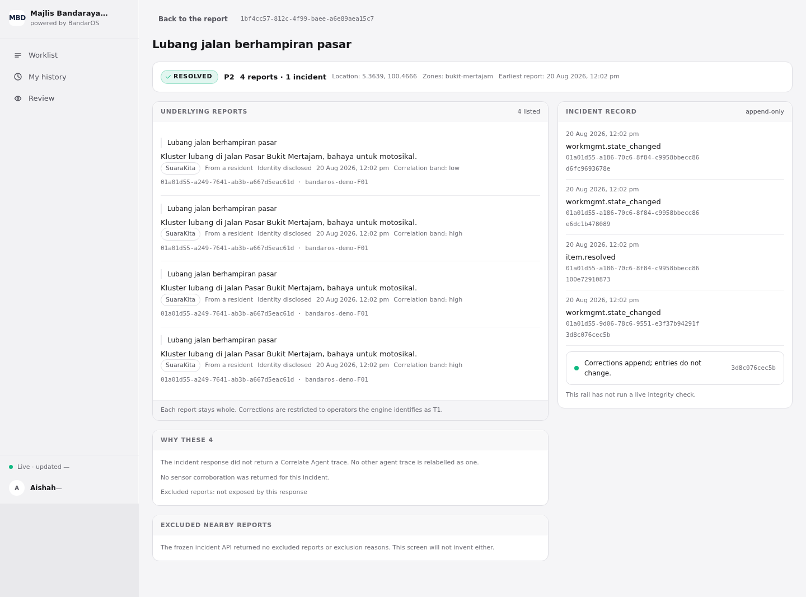
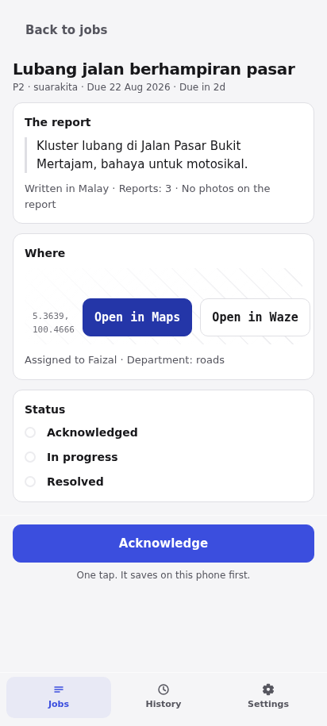
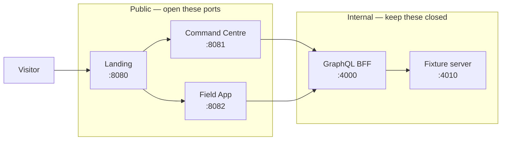

# Rakyat AI — BandarOS demo

A council receives a complaint, decides who should handle it, sends a crew, and
records what happened. This is a running demo of that, built for the hackathon.

It is **self-contained**. You need Node 24 and nothing else — no `npm install`,
no database, no API keys. Copy the `dist/` folder and run one script.

There are two apps:

- **Command Centre** — the council's desktop side. Triage, routing, the record.
- **Field App** — the crew's phone side. Your jobs, status, proof, close.

Both run on the same recorded morning, so what one desk does shows up on the other.

---

## Demo video

**2 minutes 36 seconds** — the whole journey, from a resident reporting a
pothole to a crew closing it.

[](demo-video/RakyatAI-Hackathon-Demo.mp4)

▶ **[demo-video/RakyatAI-Hackathon-Demo.mp4](demo-video/RakyatAI-Hackathon-Demo.mp4)** · 1080p · 30 MB

The file is stored in Git LFS. On GitHub, click through and press download —
the browser will not play it inline. Locally, `git lfs pull` first if you cloned
without LFS, otherwise you get a one-line text file instead of a video.

---

## Screenshots

**The worklist.** Everything open in the council, most urgent first. Reports
arrive from citizens (`SuaraKita`), from sensors, or typed in by hand.



**One report.** The citizen's words are kept exactly as written. Three agents
each *propose* something — which council area it falls in, which department owns
it, who should be assigned — and a person confirms. Every action lands in a
Record on the right that can only be appended to.



**Four reports, one pothole.** The same problem reported four times is grouped
into a single incident, and the screen shows why it was grouped.



**The crew's phone.** The job, where it is, and one tap to move it along.



---

## How it fits together



The fixture server replays recorded engine responses. There is no live engine and
no database on the machine — that is what makes the folder portable.

---

## Before you start

- **Node 24 or newer** (`node --version`)
- **[Git LFS](https://git-lfs.com)** — the demo video and the submission PDFs are stored with it
- Ports `8080`, `8081`, `8082`, `4000`, `4010` free

Install Git LFS once per machine, then once per user:

```bash
sudo apt install git-lfs   # macOS: brew install git-lfs
git lfs install
```

## Get it

```bash
git clone <this-repo>
cd hackathon-demo
```

If you installed Git LFS first, the video and PDFs come down with the clone. If
you did not, fetch them now:

```bash
git lfs install && git lfs pull
```

## Run it

```bash
cd dist
./start.sh
```

It prints `up` and the three addresses. Open the landing page at
<http://localhost:8080> and pick a desk.

To use different ports, set them first:

```bash
LANDING_PORT=9000 PORTAL_PORT=9001 FIELD_PORT=9002 ./start.sh
```

## Sign in

Password is `demo` for every account.

| Account | Who they are | Which app |
|---|---|---|
| `aishah@mbpp.demo` | Triage desk | Command Centre |
| `siti@mbpp.demo` | Roads department | Command Centre |
| `ops@mbpp.demo` | Council admin | Command Centre |
| `faizal@mbpp.demo` | Bukit Mertajam crew | Field App |
| `rizal@mbpp.demo` | Island crew | Field App |

New to it? The landing page links a one-page guide on what to click.

## Submission material

| Where | What |
|---|---|
| `demo-video/` | The 2:36 walkthrough, 1080p MP4 |
| `submission-material/` | The application deck and the technical architecture document, as PDFs |

All three are kept in Git LFS. A clone without LFS leaves you small text files
that begin `version https://git-lfs.github.com/...` instead of the real ones.
`git lfs pull` fixes that.

The demo itself does not need LFS — everything in `dist/` is a normal file.

## Deploying to a server

See **[dist/DEPLOY.md](dist/DEPLOY.md)** for the VPS install, the systemd unit,
the firewall rules, and HTTPS behind Caddy.

> One thing there is not optional: open only `8080`, `8081`, `8082`. The fixture
> server on `4010` carries test levers that must not be reachable from outside.

---

## What this demo is honest about

- **It is a guided walkthrough, not a sandbox.** Screens along the recorded path
  answer perfectly. Step off it and you get `501 MOCK_FIXTURE_MISSING` rather
  than invented data.
- **Passwords are not checked.** The fixture server signs in any address it has
  a recording for. This matches the development stack exactly.
- **The recorded morning is 20 August 2026.** Relative times and SLA badges are
  computed against today, so the further from that date you run it, the more the
  queue reads as overdue.
- **Agents propose, people decide.** Nothing is routed, grouped, or assigned
  without someone confirming it, and both the proposal and the decision stay on
  the Record.

## If it does not start

| What you see | What to do |
|---|---|
| `port 8081 is already in use` | Free the port, or set `PORTAL_PORT` and friends |
| `stack did not come up` | Read `dist/logs/{mock,bff,serve}.log` |
| A screen says `MOCK_FIXTURE_MISSING` | You stepped off the recorded path — go back and follow the guide |
| A PDF or the video opens as one line of text | Git LFS was not installed when you cloned — run `git lfs install && git lfs pull` |

Running as a service? `journalctl -u bandaros-demo -f`.

## Rebuilding `dist/`

`dist/` is committed because it is the deliverable, not a build output to
regenerate. Rebuilding it means building the two apps from the source repo and
bundling the two servers with esbuild.
